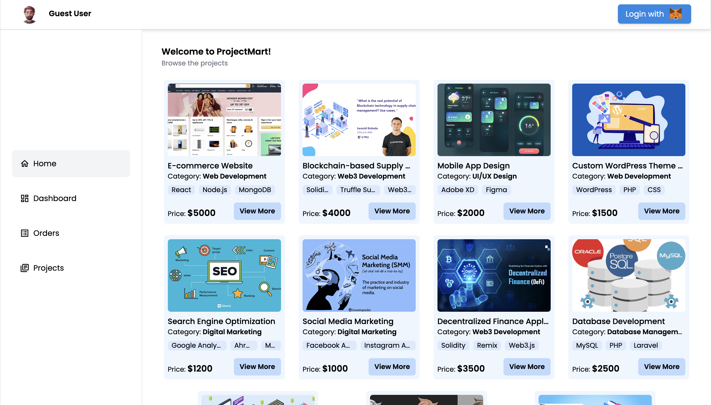
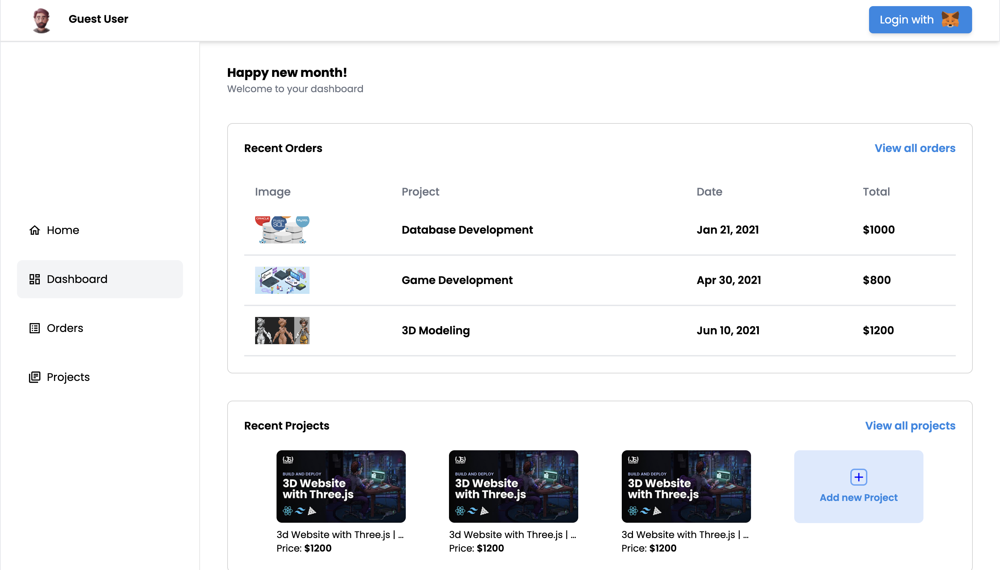
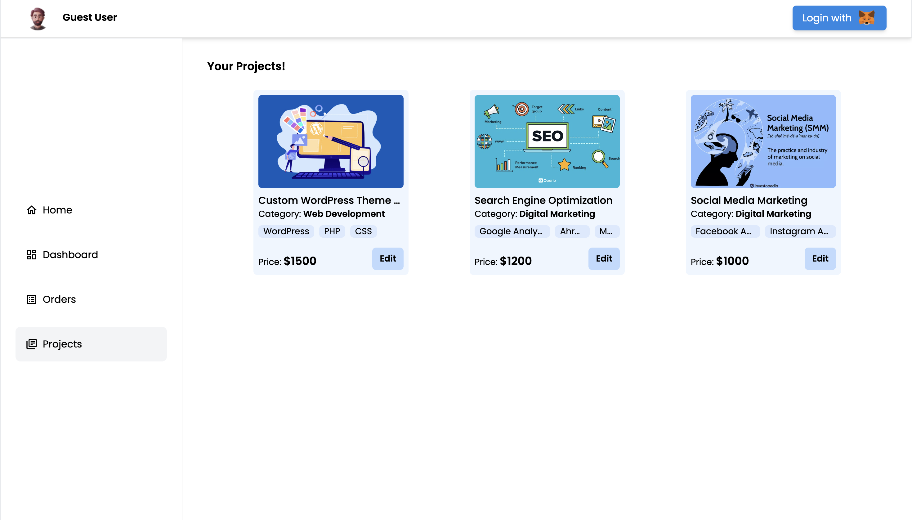
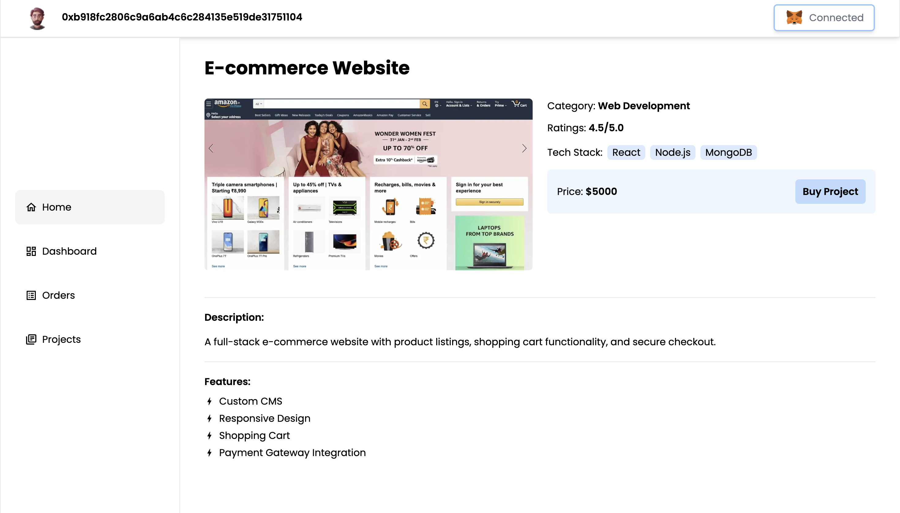
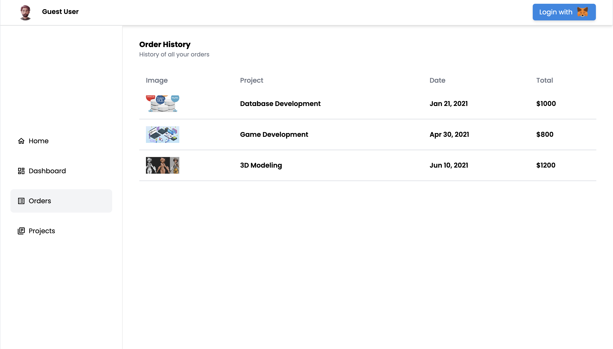
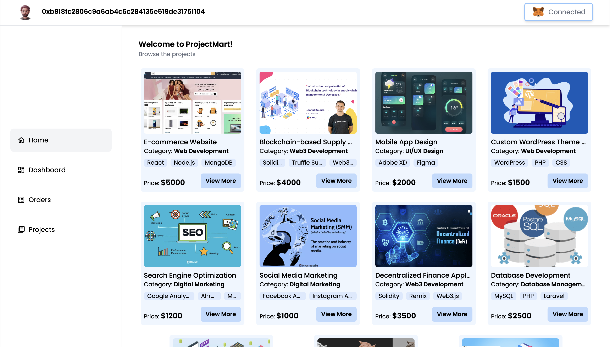

# Project Marketplace 
This is a freelance marketplace platform that allows users to buy and sell projects related to various domains. It is based on web3 login and crypto payment options, enabling secure and transparent transactions. 

## Live Demo
Check out the live demo of [Project Marketplace](https://the-project-marketplace.vercel.app/).
<div align="center">

</div>
<div id="top">

# ✅ Animation Buttons 


Welcome to the Animating Buttons repository! 🎉

This project aims to provide a collection of animated buttons that you can use to enhance your web development projects. Whether you're a beginner or an experienced developer, these buttons will add a touch of interactivity and flair to your websites.
<h1 align="center">✨✨HacktoberFest 2022✨✨</h1>


## Tech Stack
This project is built using the MERN stack, which includes:
- MongoDB for the database
- Express and Node.js for the backend
- React for the frontend

We used Spheron for deploying our backend and Vercel for deploying the frontend.
  <a href = "#top"> Back to top</a>
  
### Firstly
### 📢 Register [here](https://hacktoberfest.com/) for Hacktoberfest and make 4️⃣ PRs this month to grab free SWAGS 🔥

## Figma Design
Link to our Figma design is [here](https://www.figma.com/file/6eaNLjWwNMfCRtBjQlPVvV/Hackverse?node-id=0%3A1&t=kf91LFDpRkVXgwCv-1).

## Pages

### Home Screen

<kbd>  </kbd>

### Dashboard

<kbd>  </kbd>

### Projects

<kbd>  </kbd>
```terminal
npm i
npm start
```
  
- Create a new Branch

```
git checkout -b my-new-branch
```

🚀🚀  **Go to [public/Buttons](https://github.com/Spyware007/Animating-Buttons/blob/main/src/components/Main/Main.jsx) folder and add a new folder with your GitHub username including your button code (index.html + style.css files)**

- Then go to [src/Data.js](https://github.com/Spyware007/Animating-Buttons/blob/main/src/Data.js)

- Add your folder name (github_username, github_username_1,etc) code in [src/Data.js](https://github.com/Spyware007/Animating-Buttons/blob/main/src/Data.js) file.

  <a href = "#top"> Back to top</a>
  
# Note: 
- Make sure to align your button centered horizontally as well as vertically.
- Don't forget to replace 'your_github_username' with GitHub Username.
- If you are adding more than one buttons then give proper names such as Spyware007_1,Spyware007_2, your_github_username_1,etc

### Project Details

<kbd>  </kbd>

### Orders

<kbd>  </kbd>

### Metamask Connected

<kbd>  </kbd>

----
<a href = "#top"> Back to top</a>
# Our Beloved Contributors 😍

## How to Clone and Run the Project

To clone and run the project, follow these steps:
1. Open your terminal and navigate to the directory where you want to store the project.
2. Clone the repository using the following command: git clone [https://github.com/ak736/project-marketplace.git]
3. Navigate to the project directory
4. Install the necessary dependencies by running the following command in the root directory: npm install
5. To start the frontend and backend servers concurrently, run the following command in the root directory:
  - Frontend : npm run dev
  - Backend : npm start

## Contributing

Pull requests are welcome. For major changes, please open an issue first to discuss what you would like to change.
A big thank you to all our contributors who have made this project better with their valuable contributions! We appreciate your efforts and dedication.

Don't forget to ⭐ this repository to show your support!

---

<h3 align="center"> DON'T FORGET TO ⭐ THIS REPOSITORY !!
</h3> 

## Credits

Sympto-Tracker was developed by:

- [Aniket Kumar](https://github.com/ak736)
- [Anto Vimalan](https://github.com/vimalds15)

If you have any questions or feedback, please reach out to [aniketkir63@gmail.com].
###  You can follow me [here](https://github.com/Spyware007) ❤
  <a href = "#top"> Back to top</a>
</div>
  
