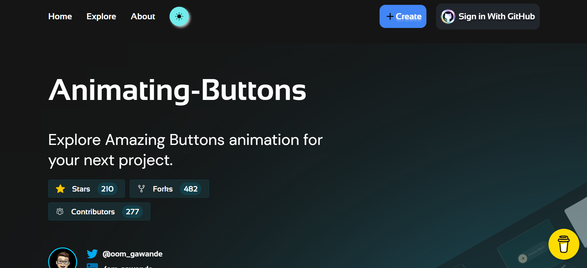
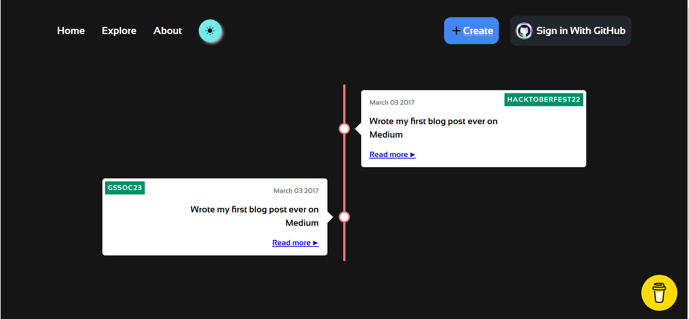
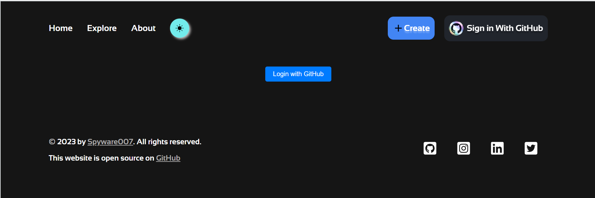
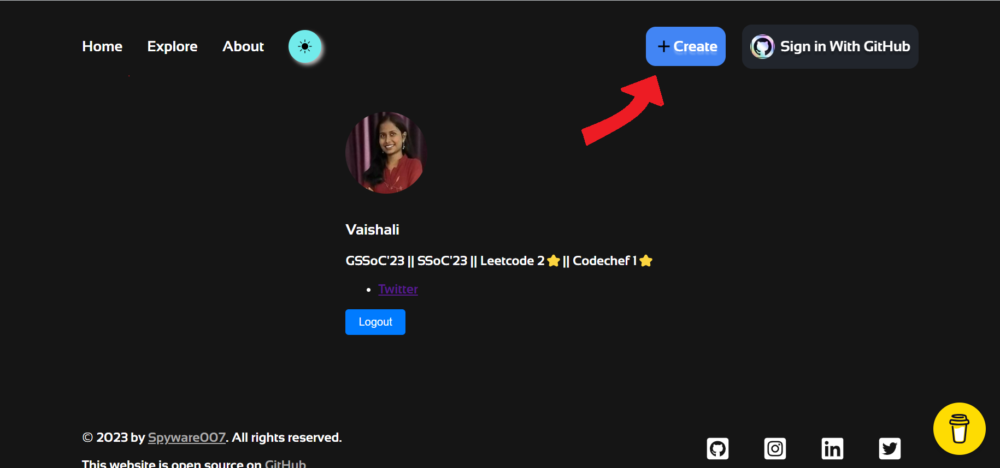
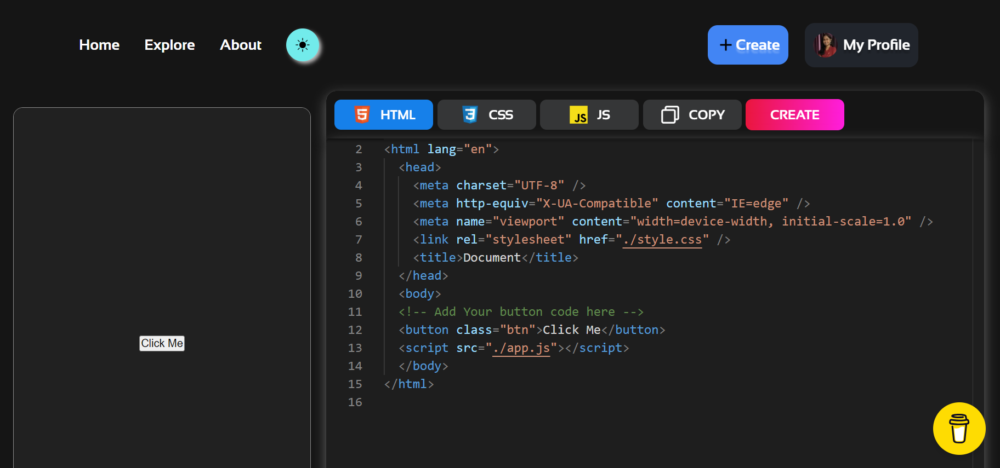

# Readme Will be Updated soon.
# Don't follow this Readme for contributions.

<!-- GDSC DY PATIL COLLEGE OG ENGINEERING, PUNE LOGO -->

<div align="center">

</div>

<!-- ANIMATING BUTTONS HEADING -->
<h1 style="margin-top:0px"align = "center"> ✅ Animating Buttons </h1> 

<br><br>

---

<!-- ANIMATING BUTTONS WEBSITE GLIMPSE -->

<div align="center" style="display:flex ">

<!--  -->
<br><br>
</div>
<table>
  <tr>
    <td></td>
    <td></td>
  </tr>
  <tr>
    <td></td>
    <td></td>
  </tr>
  <!-- <tr>
    <td></td>
    <td></td>
  </tr>
  <tr>
    <td></td>
    <td></td>
  </tr> -->
</table>

---


------------

<br>
<br>

<!-------------------------------------------------------- BADGES---------------------------------------------------------------- -->

<div align="center">


  <br>
  
  
  
  
  
  
  
  
  
  

 </div> 


<br>
<br>

----------------

<br>

<!------------------------------------------- WECOME TO ANIMATING BUTTONS------------------------------------------ -->
<div align = "center">

# Welcome to Animating Buttons🎉! 

</div>

<div align="center">

Coolest place in the digital universe, the Animating Buttons repository! This project aims to provide a collection of animated buttons that you can use to enhance your web development projects. Whether you're a beginner or an experienced developer, these buttons will add a touch of interactivity and flair to your websites.

</div>

------------------------------------------------------------------------------------------------------------------------------------------------


<!------------------------------------ GSSOC'23------------------------ -->

<h1 align="center"> GSSoC 2023 〽️ <h1>
<div align="center">


</div> 

-------------------------------------------------------------------------------------------------------------------------------------------------------------

<!-------------------------------------  TABLE OF CONTENT---------------------- -->
<h1 align="center"> Table of Contents </h1>
<div>

 - [Welcome to Animating Buttons](https://github.com/arcVaishali/Animating-Buttons/tree/main#welcome-to-animating-buttons)
 - [What can you Contribute](https://github.com/arcVaishali/Animating-Buttons/tree/main#what-can-you-contribute-%EF%B8%8F-)
 - [How to Contribute](https://github.com/arcVaishali/Animating-Buttons/tree/main#-how-to-start-contributing-%EF%B8%8F)
    + [First Steps](#first-steps )
    + [Login to the website](https://github.com/arcVaishali/Animating-Buttons/tree/readme-1102#login-to-the-animating-buttons--)
    + [For GSSoC'23 Contribution, follow these steps-](https://github.com/arcVaishali/Animating-Buttons/tree/readme-1102#for-gssoc23-contribution-follow-these-steps--)
        - [Fork, Clone, Navigate the Repository](https://github.com/arcVaishali/Animating-Buttons/tree/readme-1102#fork-clone-navigate-the-repository-)
 - [How to Make a PR?](https://github.com/arcVaishali/Animating-Buttons/tree/main#-how-to-make-a-pr-)
    + [Stage, Commit, PR](https://github.com/arcVaishali/Animating-Buttons/tree/readme-1102#initiate-your-contribution-for-gssoc23-with-these-steps-)
 - [Key Reminders for your Attention](https://github.com/arcVaishali/Animating-Buttons/tree/main#--key-reminders-for-your-attention-)
 - [Tech Stack](https://github.com/arcVaishali/Animating-Buttons/tree/main#-tech-stack-used-)
 - [Our Involvement in Notable Open Source Programs](https://github.com/arcVaishali/Animating-Buttons/tree/main#-involvement-in-notable-open-source-programs--)
 - [Connect with Project Admin](https://github.com/arcVaishali/Animating-Buttons/tree/main#-project-admin-)
 - [Connect with Project Mentors](https://github.com/arcVaishali/Animating-Buttons/tree/main#-project-mentors-)  
 - [Our Beloved Contributors](https://github.com/arcVaishali/Animating-Buttons/tree/main#-our-beloved-contributors--)

 </div>


<!-- --------------------------WHAT CAN YOU CONTRIBUTE---------------------------------------- -->
________________________________________________________________________________________________________________________
<h1 align="center">
What can You Contribute? 👩‍💻 
</h1>


<div align="center">

| **Contribution Guidelines**                                                                            |
|--------------------------------------------------------------------------------------------------------|
| - You can contribute any animated buttons. ⬆️                                                         |
| - You can update or refine an existing animated button or even add your own new buttons to this repository. 🚀 |                           |
| - Make sure you follow the below steps before making your contributions. ❗❗❗                      |

</div>

__________________________________________________________________________________________________________________________________________

<!-- ### Contribution Steps: -->

<!-- ----------------HOW TO START CONTRIBUTING------------------------------------------------- -->

<h1 align="center"> How to start contributing? 💻 </h1>

## Animating Buttons Repository Instructions 🚀🚀  <br> <br>

### First Steps-
1. Create **issue** in the Animating Buttons repository.
2. Once you are assigned the **issue**, move ahead with the following procedure-

<br> 

### Login to the [Animating Buttons](https://lets-animate-btns.vercel.app/) Website <br>

3. **No need to make any changes in the repository.**
4. **Login** using your GitHub Account on our website, as shown in above [screenshots](https://github.com/arcVaishali/Animating-Buttons/blob/readme-1102/readme-assets/log-in-page.png)
5. Click on **CREATE** button on the nav-bar, as shown in above [screenshots](https://github.com/arcVaishali/Animating-Buttons/blob/readme-1102/readme-assets/after-login.png) 
6. Create your button **directly** on the website, as shown in above [screenshots](https://github.com/arcVaishali/Animating-Buttons/blob/readme-1102/readme-assets/create.png)  


<br>

### For GSSoC'23 Contribution, follow these steps- <br> 
#### Fork, Clone, Navigate the Repository <br>
7. After you have created the button on the website, fork the repository (Click the <b><b><a href="https://github.com/Spyware007/Animating-Buttons/fork" class="github-button" data-color-scheme="no-preference: light_high_contrast; light: light_high_contrast; dark: dark;" data-icon="octicon-repo-forked" data-size="large" data-show-count="true" aria-label="Fork Princeton21/Data-Structures-and-Algorithms on GitHub">Fork</a></b></b> button in the top right corner of the page).

- Clone the forked repo to your local machine using the following command:
    ```terminal
    git clone https://github.com/**username**/Animating-Buttons.git
    ```

- Navigate to project directory.
    ```terminal
    cd Animating-Buttons
    ```

    ```terminal
    npm i
    npm start
    ```

- Create a new Branch
    ```
    git checkout -b my-new-branch
    ```
<br><br>
<h1 align="center"> How to Make a PR? 👨‍💻 </h1>

#### Initiate your contribution for GSSoC'23 with these steps <br>
8. Once you have cloned the repository and created a new branch, proceed with the following steps to initiate your contribution-                                 
      - Make an **empty commit**.
         ```
         git commit --allow-empty -m "Empty commit for PR"
         ``` 
      - Then push 
         ```
         git push origin my-new-branch
         ``` 
      - Finally, create a new pull request from your forked repository. Note this PR will be an **Empty PR**.

-------------------
<!----- TO KNOW MORE, READ CONTRIBUTING GUIDELINES--- -->
9. To know more about how to contribute, read the [Countributing Guidelines](https://github.com/arcVaishali/Animating-Buttons/blob/main/CONTRIBUTING.md) 🚀🚀


<!-- -------IN CASE YOU GET STUCK ANYWHERE---------- -->
10. You can refer to the following articles on basics of Git and Github and *also contact the Project   Mentors, in case you are stuck:*
     - [Forking a Repo](https://docs.github.com/en/get-started/quickstart/fork-a-repo)
     - [Cloning a Repo](https://docs.github.com/en/desktop/contributing-and-collaborating-using-github-desktop/working-with-your-remote-repository-on-github-or-github-enterprise/creating-an-issue-or-pull-request-from-github-desktop)
     - [How to create a Pull Request](https://opensource.com/article/19/7/create-pull-request-github)
     - [Getting started with Git and GitHub](https://towardsdatascience.com/getting-started-with-git-and-github-6fcd0f2d4ac6)

________________________________________________________________________________________________________________


<!-- ------------KEY REMINDERS FOR YOUR ATTENTION----------------- -->
<div align="center">

<h1 align="center">  Key Reminders for Your Attention </h1>

|  **SNo.** |      **Description**                                                                      |
|-----------|-------------------------------------------------------------------------------------------|
|     1     | **No need to make any changes in the repository**❗❗                                   |
|     2     | Buttons will be added **directly** on the website, Visit the website.                       |
|     3     | Fork, Clone and Make new branch, and then make an **Empty Commit** as explained above                            |
</div>

_________________________________________________________________________________________________________________


<!-------------- OUR INVOLVEMENT IN NOTABLE OPEN SOURCE PROGRAMS----------- -->
<h1 align="center"> Our Involvement in Notable Open Source Programs </h1>

<div align="center">


<a href="https://hacktoberfest.digitalocean.com/" target="_blank" rel="noopener noreferrer">
  
</a>

<br>


<a href="https://gssoc.girlscript.tech/" target="_blank" rel="noopener noreferrer">
  
</a>


</div>

________________________________________________________________________________________________________________


<!-- ------------TECH STACK USED---------------------- -->
<h1 align ="center"> Tech Stack Used </h1>
<div align="center">


</div>


____________________________________________________________________________________________________________


<!-- ------------ CONNECT WITH PROJECT ADMIN----------------- -->

<h1 align='center'> Project Admin </h1>
<table align='center'>
<tr>
    <td align="center">
        <a href="https://www.linkedin.com/in/om-gawande/">
            
            <br />
            <sub><b>Om Gawande</b></sub>
        </a>
    </td>
  </tr>
</table>


___________________________________________________________________________________________________________________________________________________________________


<!-- ----------------CONNECT WITH PROJECT MENTORS---------------------- -->
<h1 align='center'> Project Mentors </h1>
<table align='center'>
<td align="center"><a href="https://www.linkedin.com/in/tanyachanchalani/"><br /><sub><b> Tanya Chanchalani </b></sub></a></td>

<td align="center"><a href="https://www.linkedin.com/in/poorvi-shetty/"><br /><sub align="bottom"><b>Poorvi Shetty</b></sub></a></td>

</table>


__________________________________________________________________________________________________________________


<!-- -----------------OUR BELOVED CONTRIBUTORS-------------------- -->
<h1 align="center"> Our Beloved Contributors 😍 </h1>

<a href="https://github.com/Spyware007/Animating-Buttons/graphs/contributors">
  
</a>

---

<a align = "right" href = "#top"> Back to top</a>

_##A special note for a particular issue some users can face in the project##_

_Upon initializing <npm run start>, the following message may be prompted on the terminal._
'react-scripts' is not recognized as an internal or external command, operable program or batch file.
To eliminate that: You can use <npm install> to acquire the missing dependencies.

_But during npm install, the following error can occur:_
npm WARN deprecated stable@0.1.8: Modern JS already guarantees Array#sort() is a stable sort, so this library is deprecated. See the compatibility table on MDN: https://developer.mozilla.org/en-US/docs/Web/JavaScript/Reference/Global_Objects/Array/sort#browser_compatibility

The warning message received indicates that the package 'stable' you have installed is deprecated. The 'stable' package was previously used to provide a stable sorting algorithm for older versions of JavaScript that did not guarantee the stability of the `Array#sort()` method. However, modern versions of JavaScript now ensure that `Array#sort()` is a stable sort, making the 'stable' package unnecessary.

The warning message suggests referring to the compatibility table on MDN (Mozilla Developer Network) to understand the browser compatibility of the `Array#sort()` method. The table provides information about which browser versions support stable sorting using `Array#sort()`.

_To address this issue:_
we can simply use the command:
<npm update stable>

After this when we again run the command: <npm run start>, the website will work just fine.

---

A big thank you to all our contributors who have made this project better with their valuable contributions! We appreciate your efforts and dedication.

Don't forget to ⭐ this repository to show your support!

---

PS: A big thank you to all our contributors who have made this project better with their valuable contributions! We appreciate your efforts and dedication.

<h3 align="center"> DON'T FORGET TO ⭐ THIS REPOSITORY !!
</h3>

### You can follow me [here](https://github.com/Spyware007) ❤

<a href = "#top"> Back to top</a>


</div>

</div>
  

  


